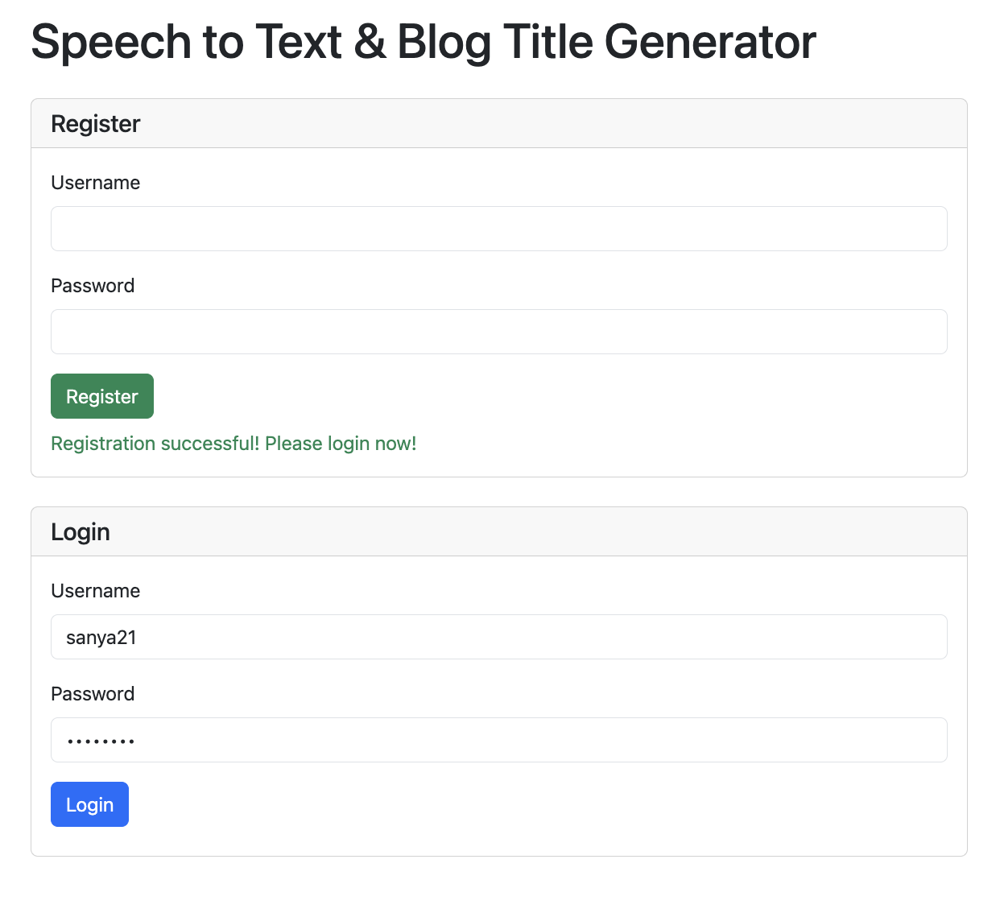
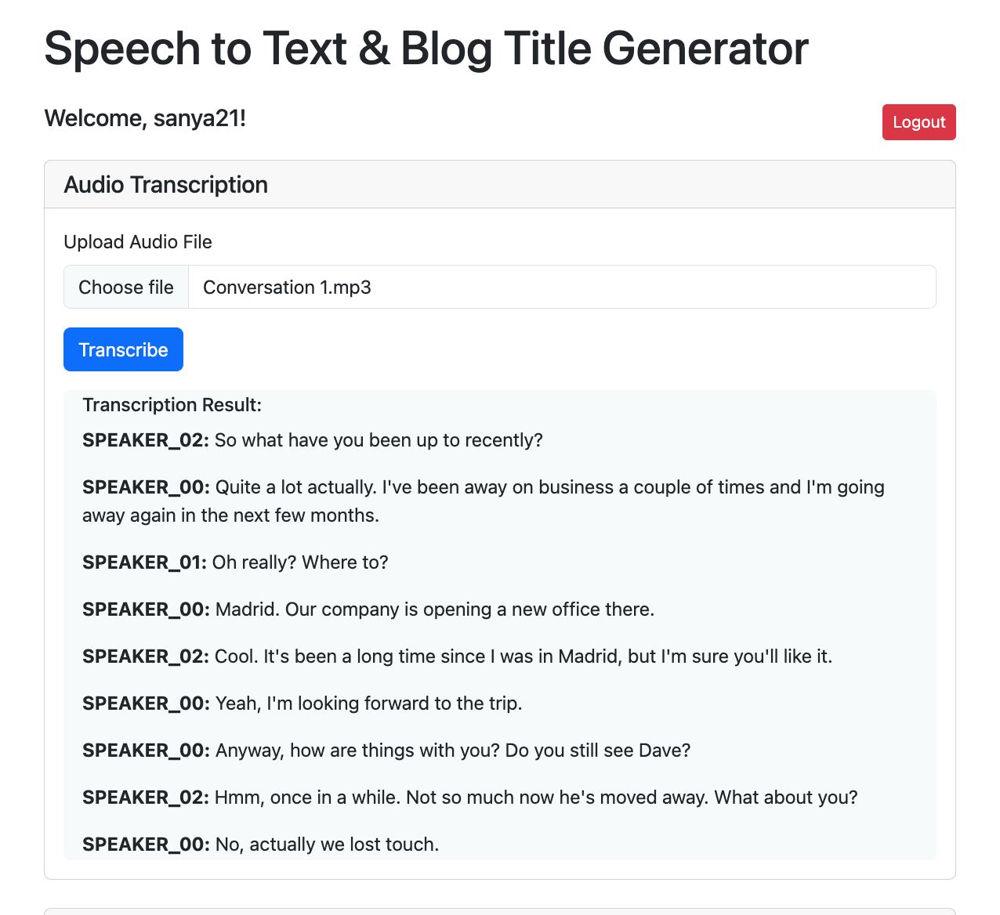
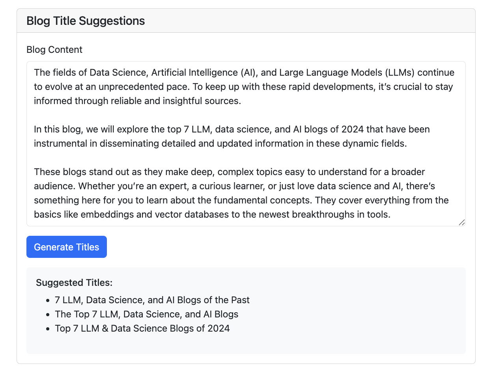

# Speech2Text Diarization and Blog Titles Generator

A Django web app for:
- **Speaker-diarized audio transcription** (using Whisper + pyannote.audio)
- **AI-powered blog title suggestions** (using HuggingFace headline generation models)
- **User registration, login, and history**

---

## Project Structure

```
speech2text_blog_titles/
├── api/                    # Django app with API endpoints and logic
├── speech2text_blog/       # Django project settings
├── templates/api/          # Frontend HTML (single-page app)
├── speech2text_example/    # Example audio and output
│   ├── Conversation 1.mp3
│   └── conversation1_transcription.png
├── blog_sample_output.png  # Example blog title output
├── login_page.png          # Example login/registration page
├── db.sqlite3              # SQLite database (created after first run)
├── requirements.txt        # Python dependencies
├── README.md               # Project documentation
├── manage.py               # Django's command-line utility
└── ...
```

---

## Project Description

This app lets you:
- Upload an audio file and get a **speaker-diarized transcript** (who said what, when)
- Paste a blog draft and get **AI-generated blog title suggestions**
- Register/login to save your history
- Works for English and many other languages (Whisper supports Hindi, etc.)

---

## Installation & Setup

1. **Clone the repo:**
   ```bash
   git clone https://github.com/sanya21561/speech2text-blog-titles
   cd speech2text_blog_titles
   ```
2. **Create a virtual environment (Python 3.11 recommended):**
   ```bash
   python3.11 -m venv venv311
   source venv311/bin/activate
   ```
3. **Install dependencies:**
   ```bash
   pip install -r requirements.txt
   ```
4. **Set up HuggingFace token:**
   - Create a `.env` file with your HuggingFace token:
     ```
     HUGGINGFACE_TOKEN=your_hf_token_here
     ```
   - Accept model conditions for `pyannote/speaker-diarization-3.1` on the HuggingFace website.
5. **Run migrations:**
   ```bash
   python manage.py migrate
   ```
6. **Create a superuser (optional, for admin):**
   ```bash
   python manage.py createsuperuser
   ```
7. **Run the server:**
   ```bash
   python manage.py runserver
   ```
8. **Open the app:**
   Go to [http://127.0.0.1:8000/](http://127.0.0.1:8000/)

---

## API Endpoints

All endpoints return **valid JSON** and handle errors gracefully.

### `/api/register/`  
- **POST** `{ "username": ..., "password": ... }`
- **Response:** `{ "message": ... }` or `{ "error": ... }`
- **Errors:** Already registered, missing fields, etc.

### `/api/login/`  
- **POST** `{ "username": ..., "password": ... }`
- **Response:** `{ "token": ..., "user_id": ..., "username": ... }` or `{ "error": ... }`
- **Errors:** Not registered, incorrect password, etc.

### `/api/transcribe/`  
- **POST** (multipart/form-data, `audio_file`)
- **Requires:** Auth token in `Authorization: Token ...` header
- **Response:** `{ "transcription": [ { "speaker": ..., "text": ..., ... }, ... ] }` or `{ "error": ... }`
- **Errors:** File missing, file error, timeout, etc.

**Example Response:**
```json
{
    "transcription": [
        {
            "speaker": "SPEAKER_02",
            "text": "So what have you been up to recently?",
            "start_time": 0.0,
            "end_time": 2.12
        },
        {
            "speaker": "SPEAKER_00",
            "text": "Quite a lot actually. I've been away on business a couple of times and I'm going away again in the next few months.",
            "start_time": 2.68,
            "end_time": 9.38
        },
        {
            "speaker": "SPEAKER_01",
            "text": "Oh really? Where to?",
            "start_time": 9.8,
            "end_time": 11.0
        },
        {
            "speaker": "SPEAKER_00",
            "text": "Madrid. Our company is opening a new office there.",
            "start_time": 11.48,
            "end_time": 14.58
        },
        {
            "speaker": "SPEAKER_02",
            "text": "Cool. It's been a long time since I was in Madrid, but I'm sure you'll like it.",
            "start_time": 15.1,
            "end_time": 19.42
        },
        {
            "speaker": "SPEAKER_00",
            "text": "Yeah, I'm looking forward to the trip.",
            "start_time": 19.82,
            "end_time": 21.6
        },
        {
            "speaker": "SPEAKER_00",
            "text": "Anyway, how are things with you? Do you still see Dave?",
            "start_time": 22.36,
            "end_time": 25.5
        },
        {
            "speaker": "SPEAKER_02",
            "text": "Hmm, once in a while. Not so much now he's moved away. What about you?",
            "start_time": 26.259999999999998,
            "end_time": 30.64
        },
        {
            "speaker": "SPEAKER_00",
            "text": "No, actually we lost touch.",
            "start_time": 31.32,
            "end_time": 32.9
        }
    ]
}
```

### `/api/suggest-titles/`  
- **POST** `{ "content": ... }`
- **Requires:** Auth token
- **Response:** `{ "suggestions": [ ... ] }` or `{ "error": ... }`
- **Errors:** Input too long, model error, etc.


**Example Response:**
```json
{
  "suggestions": [
    "The Top 7 LLM, Data Science, and AI Blogs of 2024",
    "Top 7 LLM Blogs in 2024 - A Look",
    "Data Science – The Top 7 LLM, Data Science, and AI"
  ]
}
```

### `/api/history/`  
- **GET**
- **Requires:** Auth token
- **Response:** `{ "transcriptions": [...], "title_suggestions": [...] }`

**Where are results stored?**
- All transcriptions and title suggestions can be viewed on frontend in the History section. They are also stored in the SQLite database (`db.sqlite3`) and are accessible via `/api/history/` and Django admin. 

---

## Registration & Login Demo

- Register a new user or login with existing credentials.
- Friendly error messages for duplicate registration, wrong password, or unregistered users.



---

## Speech Transcription & Diarization Sample Output

- Upload an audio file (e.g., `speech2text_example/Conversation 1.mp3`)
- Get a diarized transcript (see below):



---

## Blog Title Generation Demo

**Sample Input:**
```
The fields of Data Science, Artificial Intelligence (AI), and Large Language Models (LLMs) continue to evolve at an unprecedented pace. To keep up with these rapid developments, it's crucial to stay informed through reliable and insightful sources.

In this blog, we will explore the top 7 LLM, data science, and AI blogs of 2024 that have been instrumental in disseminating detailed and updated information in these dynamic fields.

These blogs stand out as they make deep, complex topics easy to understand for a broader audience. Whether you're an expert, a curious learner, or just love data science and AI, there's something here for you to learn about the fundamental concepts. They cover everything from the basics like embeddings and vector databases to the newest breakthroughs in tools.
```

**Sample Output:**



---

## Model Details

- **Transcription:**
  - [openai/whisper](https://github.com/openai/whisper) ("base" model, supports English, Hindi, and many other languages)
  - [pyannote/speaker-diarization-3.1](https://huggingface.co/pyannote/speaker-diarization-3.1) for speaker separation
- **Blog Title Suggestions:**
  - [Michau/t5-base-en-generate-headline](https://huggingface.co/JulesBelveze/t5-small-headline-generator) (T5-base, fine-tuned for headlines)

---

## Limitations
- **Max input length:** Blog content for title suggestions should be under 384 tokens (about 1-2 paragraphs)
- **Model creativity:** Open models may sometimes produce generic or incomplete titles
- **Audio:** Long audio files may take time to process; diarization may not always perfectly separate speakers
- **Language support:** Whisper supports many languages, but diarization is best for English

---

## Bonus Features
- **Whisper and pyannote.audio support Hindi and many other languages** (for transcription)
- **User history:** All your transcriptions and title suggestions are saved and viewable after login
- **Friendly error handling:** All endpoints return clear error messages for missing files, timeouts, or invalid input

---

## Example Files
- `speech2text_example/Conversation 1.mp3` — Example audio file
- `speech2text_example/conversation1_transcription.png` — Example diarized transcript
- `blog_sample_output.png` — Example blog title output
- `login_page.png` — Example login/registration page

---
